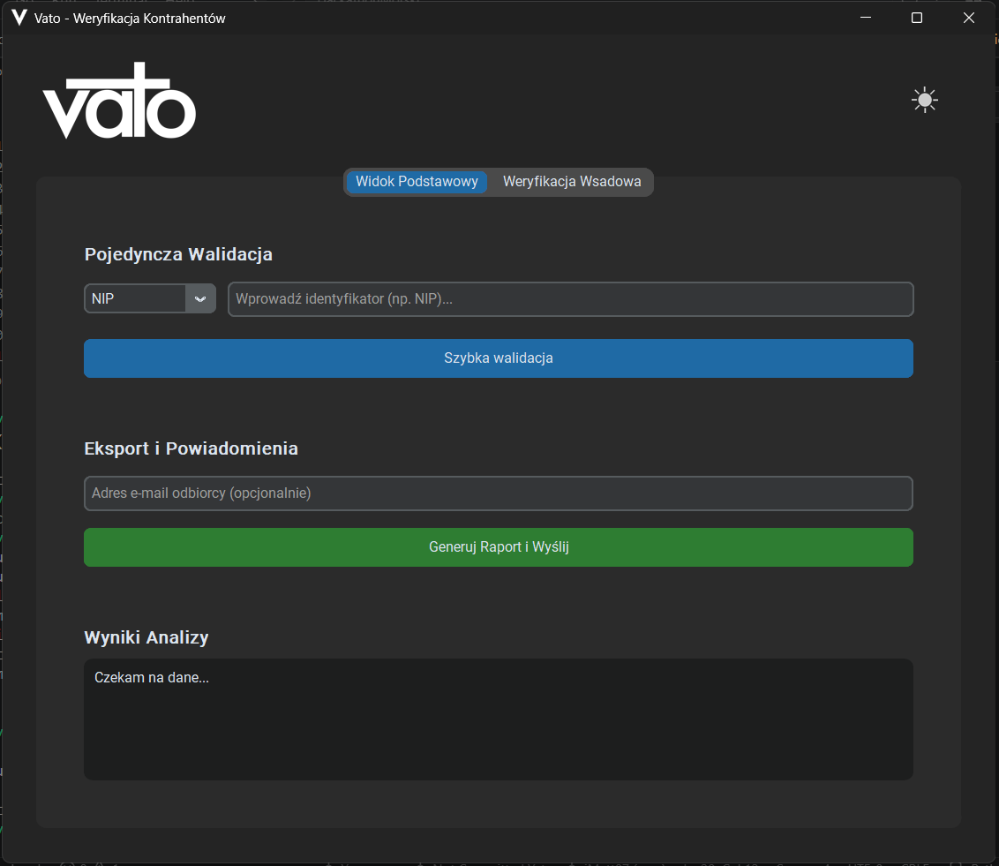
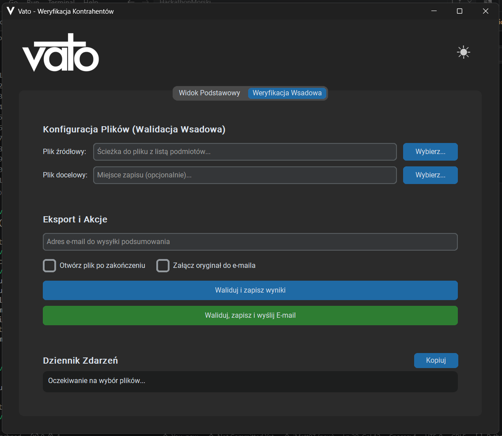
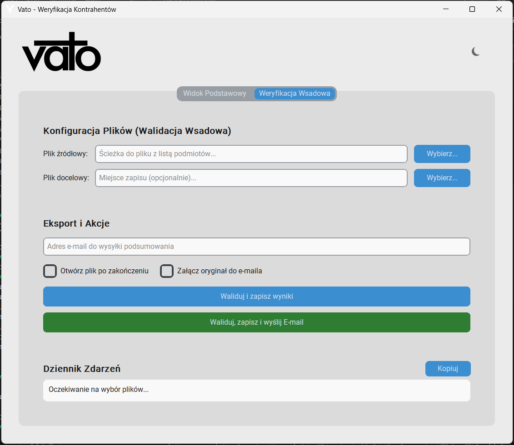

  

 

**Vato** is a robust desktop application designed for logistics analysts to automate and streamline the process of verifying contractor credibility. It seamlessly aggregates real-time data from Polish and European registries, scores contractors using a custom multi-category algorithm, and automatically generates comprehensive PDF/Excel reports.

> 🏆 **Note:** Vato was built entirely from scratch in just **24 hours** during **Hackathon Morski 2026**! 🌊

---

## 📸 Screenshots

| | |
|:---:|:---:|
|  |  |
|  |  |

---

## 🛠 Built With

Vato leverages modern Python libraries to ensure a fast, asynchronous, and responsive user experience:

- **[Python 3.12](https://www.python.org/)** – Core language.
- **[CustomTkinter](https://customtkinter.tomschimansky.com/)** – Modern, dark-mode native UI framework.
- **[Asyncio](https://docs.python.org/3/library/asyncio.html) & Threading** – Ensures the GUI never freezes during heavy background data fetching.
- **[Pandas](https://pandas.pydata.org/) & [OpenPyXL](https://openpyxl.readthedocs.io/)** – Fast structured batch data processing and Excel report generation.
- **[ReportLab](https://www.reportlab.com/)** – High-quality PDF summary generation.
- **[Pydantic](https://docs.pydantic.dev/)** – Strict typing and data validation for data models.

---

## 🔗 Integrated APIs

Vato dynamically evaluates contractors by connecting to multiple reliable data sources in parallel:

* **REGON / BIR1:** Identifies the company type (Spółka vs JDG) and fetches base corporate details.
* **KRS:** Verifies the legal and financial status of registered Polish companies.
* **CEIDG:** Checks the legal status of sole proprietorships (JDG).
* **Biała Lista Podatników VAT (KAS):** Verifies the current VAT status and bank account safety registry.
* **VIES (EU):** Verifies international and European VAT numbers.
* **ElevenLabs API:** Provides TTS (Text-to-Speech) accessibility features, reading summaries aloud to the user.

---

  <i>Created with 💻 and ☕ during Hackathon Morski 2026.</i>

