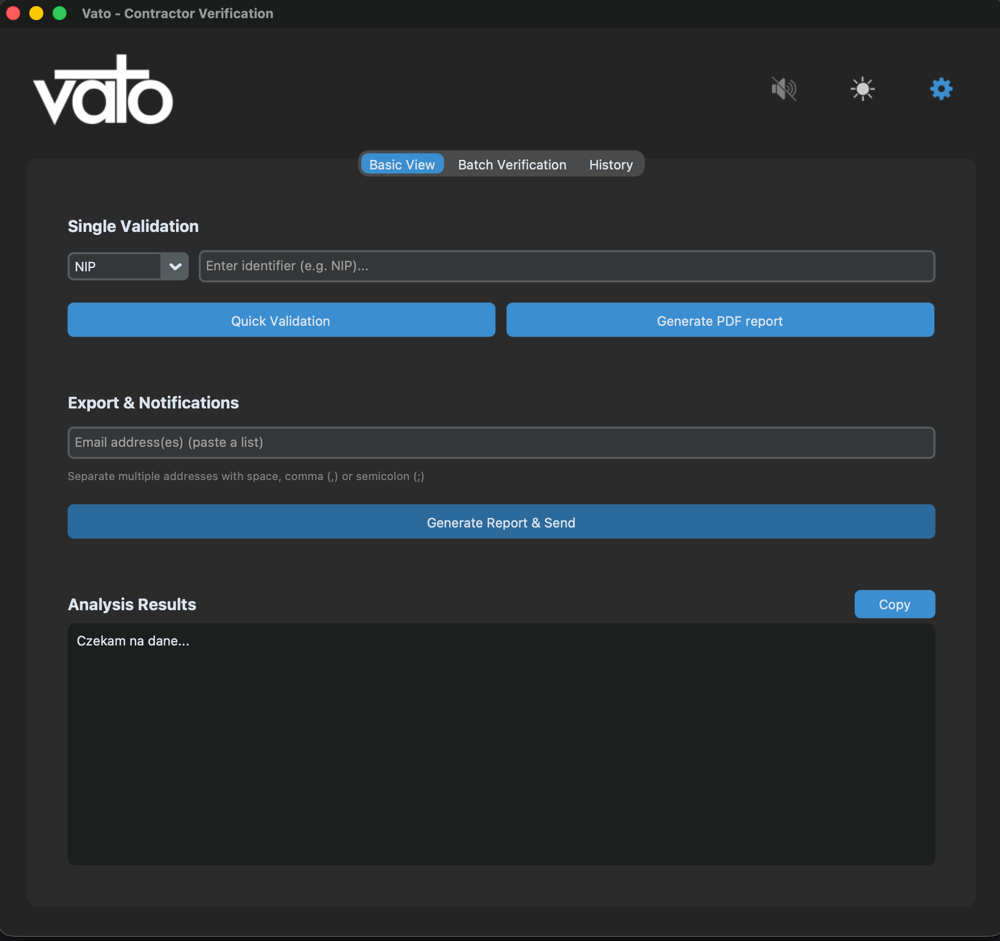
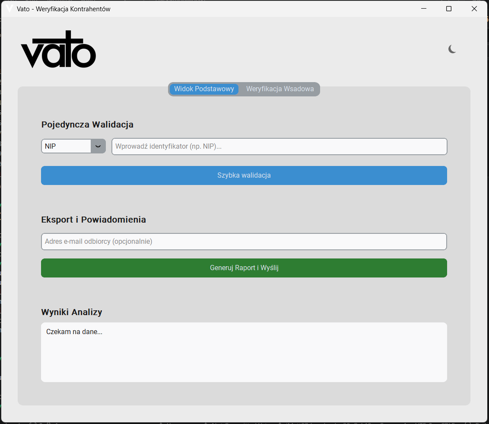
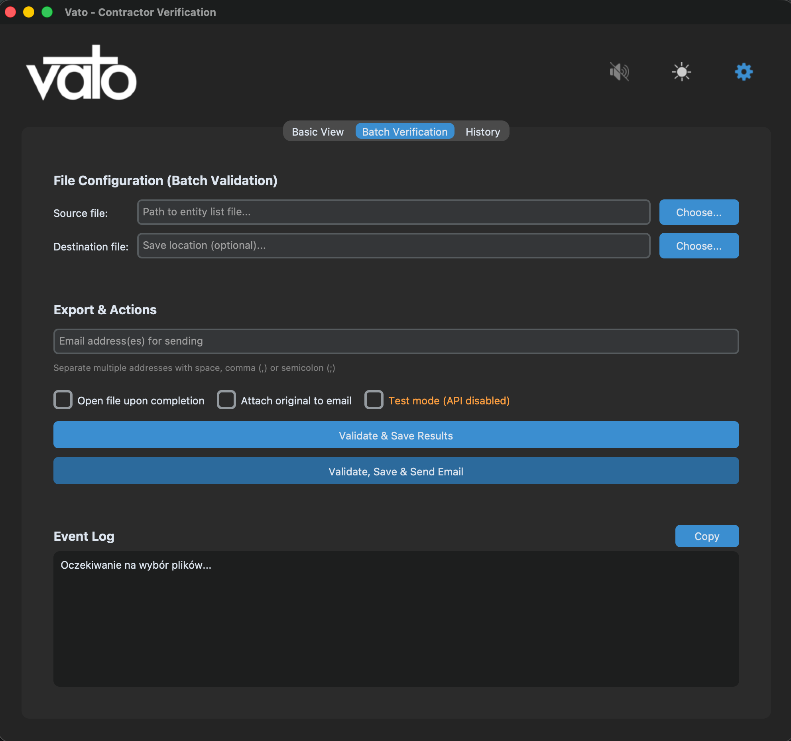
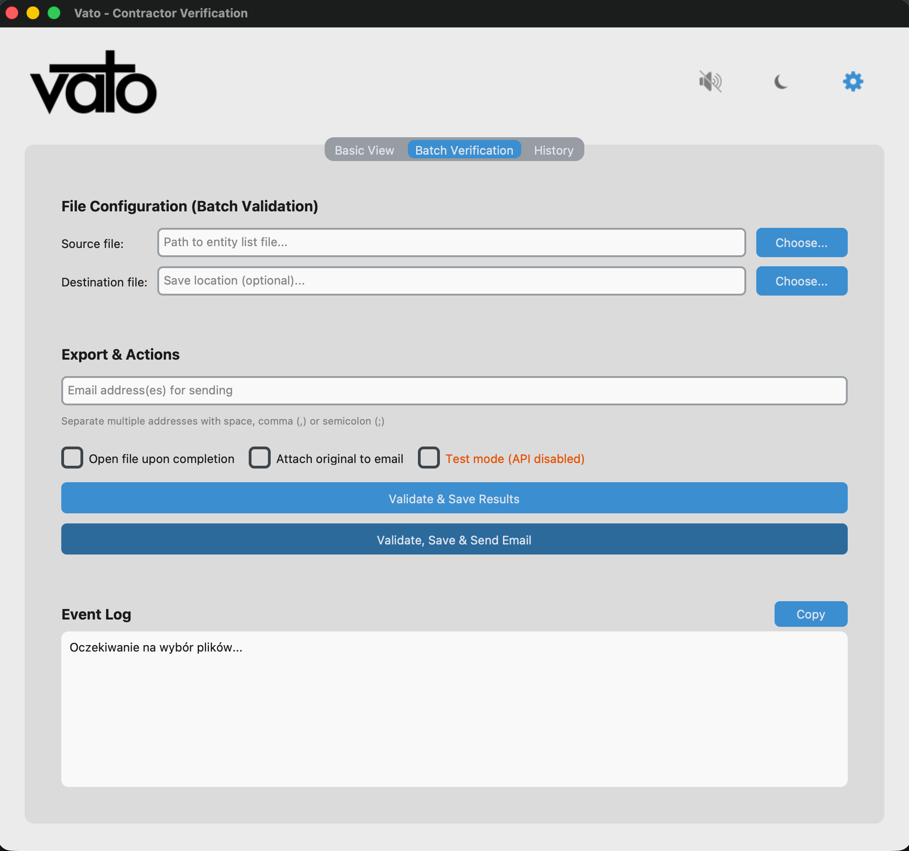
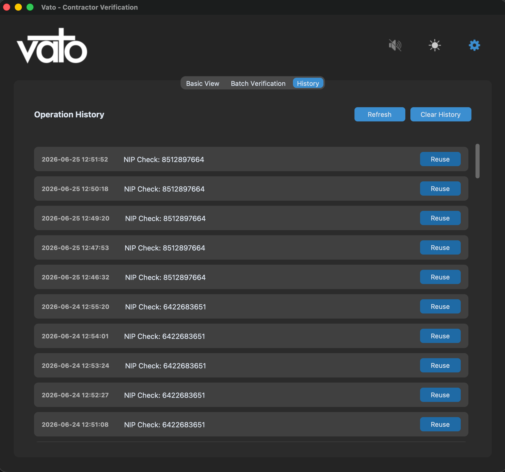
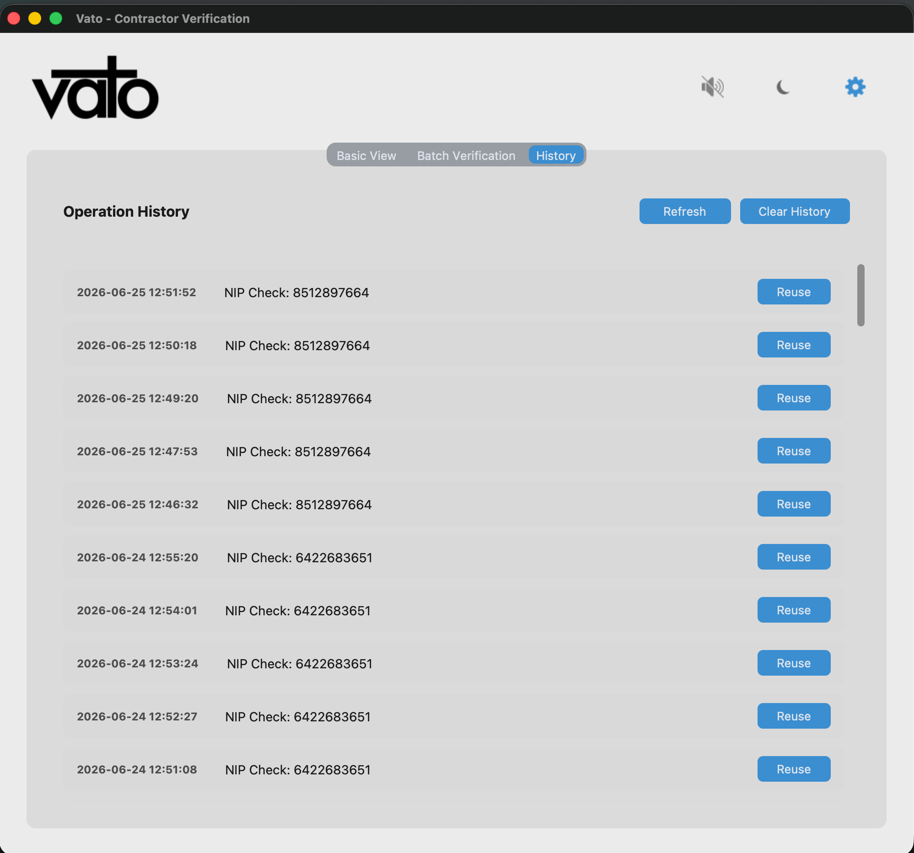
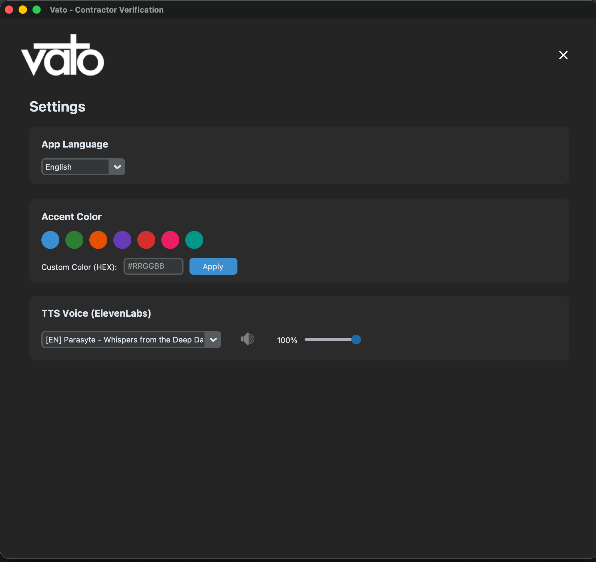
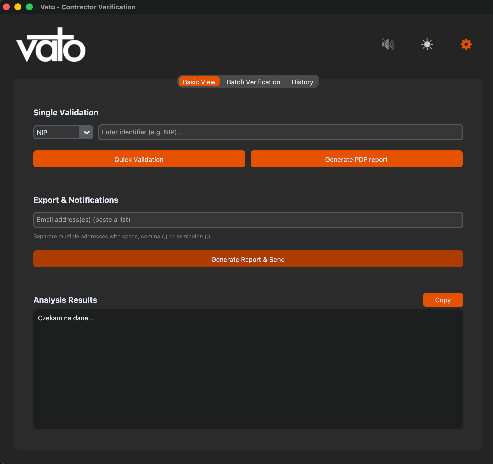

  

 

**Vato** is a robust desktop application designed for logistics analysts to automate and streamline the process of verifying contractor credibility. It seamlessly aggregates real-time data from Polish and European registries, scores contractors using a custom multi-category algorithm, and automatically generates comprehensive PDF/Excel reports.

>  **Note:** Vato was built entirely from scratch in just **24 hours** during **Hackathon Morski 2026**! 🌊

---

## 📸 Screenshots

| | |
|:---:|:---:|
|  |  |
|  |  |
|  |  |
|  |  |

---

## 🌍 Multilingual Support

Vato is ultimately designed to provide **full native support** for **Polish (PL), English (EN), and German (DE)**. 
Every single feature, interface element, and background process is intended to work flawlessly across all supported languages. Furthermore, all exported summaries and reports (both PDF and Excel) are meant to be **generated and emailed entirely in the currently selected language**.

---

## 🛠 Built With

Vato leverages modern Python libraries to ensure a fast, asynchronous, and responsive user experience:

- **[Python 3.12](https://www.python.org/)** – Core language.
- **[CustomTkinter](https://customtkinter.tomschimansky.com/)** – Modern, dark-mode native UI framework.
- **[Asyncio](https://docs.python.org/3/library/asyncio.html) & Threading** – Ensures the GUI never freezes during heavy background data fetching.
- **[Pandas](https://pandas.pydata.org/) & [OpenPyXL](https://openpyxl.readthedocs.io/)** – Fast structured batch data processing and Excel report generation.
- **[ReportLab](https://www.reportlab.com/)** – High-quality PDF summary generation.
- **[Pydantic](https://docs.pydantic.dev/)** – Strict typing and data validation for data models.

---

## 🔗 Integrated APIs

Vato dynamically evaluates contractors by connecting to multiple reliable data sources in parallel:

* **REGON / BIR1:** Identifies the company type (Spółka vs JDG) and fetches base corporate details.
* **KRS:** Verifies the legal and financial status of registered Polish companies.
* **CEIDG:** Checks the legal status of sole proprietorships (JDG).
* **Biała Lista Podatników VAT (KAS):** Verifies the current VAT status and bank account safety registry.
* **VIES (EU):** Verifies international and European VAT numbers.
* **ElevenLabs API:** Provides TTS (Text-to-Speech) accessibility features, reading summaries aloud to the user.

---

## 💻 Targeted Systems

Vato is primarily designed and targeted for **Windows** (Windows 10/11).

The codebase has been tested and confirmed to run on **Linux** and **macOS** as well, though these platforms are not the primary focus of development or support.

---

## 👥 Team & Responsibilities

* **Mateusz:** Core scoring algorithm and external API integrations.
* **Paweł:** Email services, PDF generation, and results layout for batch processing.
* **Aleksy:** GUI implementation, ElevenLabs integration, and foundations for batch processing.

---

---

## 📄 License

**Copyright © 2026 Mateusz, Paweł, Aleksy. All rights reserved.**

This software was created during **Hackathon Morski 2026** and is subject to the terms and regulations of that event. Any provisions set forth by the hackathon organizers regarding intellectual property, usage, and commercialization apply to this work and take precedence where applicable.

Beyond the hackathon's own provisions, this software is **strictly proprietary and confidential**:

- Use, copying, modification, or distribution of this software is permitted **only by the members of this team** (Mateusz, Paweł, Aleksy).
- No part of this codebase may be shared, sublicensed, published, or used outside the team without the explicit written consent of all team members.
- Commercial use is prohibited unless agreed upon in writing by all team members.

---

  <i>Created with 💻 and ☕ by Mateusz, Paweł, and Aleksy during Hackathon Morski 2026.</i>

